* Table of Contents
{:toc}

--------------------------------------------------------------------------------------------------------------------

## **Acknowledgements**

* This project is based on the AddressBook-Level3 project created by the SE-EDU initiative. Source code can be found at https://github.com/nus-cs2103-AY2526S1/tp
* **AI Generation**: Team member Kho Wei Fong used **Google Gemini** to generate the icon replacing AB3's default icon.
* **AI Assistance**: Team member Kulkarni Venugopal Vasant utilized **Claude Code** as a development aid during this project. The tool was used in the following specific ways:
  * **Software Design Consultation**: Claude Code was used as a discussion partner to explore different approaches and design patterns for features such as the `InteractionLog` system. This involved asking questions about data structure choices, class relationships, and implementation trade-offs (e.g. making InteractionLog immutable). The AI helped think through design decisions, but all final design choices and implementations were made and coded by the team member.
  * **JavaDoc Documentation**: Claude Code assisted in drafting JavaDoc comments based on already-written code to ensure proper documentation formatting and completeness. These generated comments were reviewed and often modified to match our specific implementation details and be consistent with the codebase.
  * **Unit Test Generation**: Claude Code was used to generate some unit tests, primarily for the `PinCommand` and `UnpinCommand`. All generated tests were thoroughly reviewed, modified where necessary, and verified to ensure correctness and meaningful test coverage for our specific implementation.
* **AI Assistance**: Team member Tan Peng Kiang used **Claude** to suggest dashboard metrics and identify outdated/overly-technical sections in `docs/UserGuide.md`. Outputs were reviewed and edited before being applied.
* **AI Assistance**: Team member Ng Mun Hin used **ChatGPT** to create and refine phone number and name regular expressions. Outputs were reviewed and edited before being applied.
* **AI Assistance**: Team member Ashmita Haldar used **GitHub Copilot** as a development aid, to draft and refine JavaDoc documentation, and to generate unit tests. Outputs were reviewed and edited before being applied.

--------------------------------------------------------------------------------------------------------------------

## **Design**

:bulb: **Tip:** The `.puml` files used to create diagrams are in this document `docs/diagrams` folder. Refer to the [_PlantUML Tutorial_ at se-edu/guides](https://se-education.org/guides/tutorials/plantUml.html) to learn how to create and edit diagrams.

### Architecture

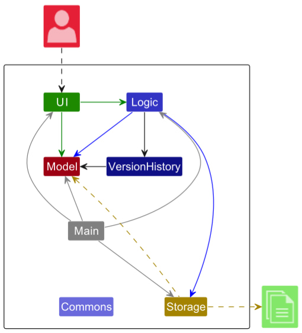

The ***Architecture Diagram*** given above explains the high-level design of the App.

Given below is a quick overview of main components and how they interact with each other.

**Main components of the architecture**

**`Main`** (consisting of classes [`Main`](https://github.com/AY2526S1-CS2103T-W09-1/tp/blob/master/src/main/java/seedu/address/Main.java) and [`MainApp`](https://github.com/AY2526S1-CS2103T-W09-1/tp/blob/master/src/main/java/seedu/address/MainApp.java)) is in charge of the app launch and shut down.
* At app launch, it initializes the other components in the correct sequence, and connects them up with each other.
* At shut down, it shuts down the other components and invokes cleanup methods where necessary.

The bulk of the app's work is done by the following five components:

* [**`UI`**](#ui-component): The UI of the App.
* [**`Logic`**](#logic-component): The command executor.
* [**`Model`**](#model-component): Holds the data of the App in memory.
* [**`Storage`**](#storage-component): Reads data from, and writes data to, the hard disk.
* [**`VersionHistory`**](#version-component): Stores different states of the contacts between commands.

[**`Commons`**](#common-classes) represents a collection of classes used by multiple other components.

**How the architecture components interact with each other**

The *Sequence Diagram* below shows how the components interact with each other for the scenario where the user issues the command `delete 1`.

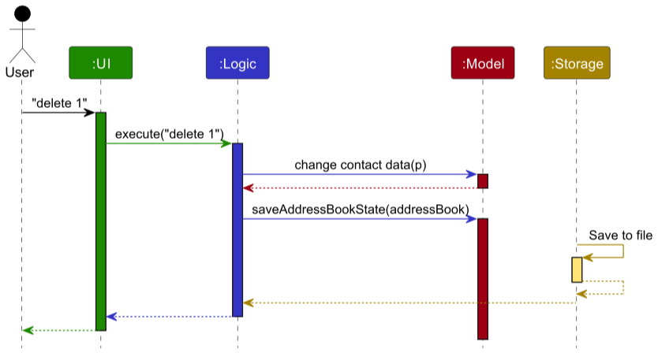

Each of the four main components (also shown in the diagram above),

* defines its *API* in an `interface` with the same name as the Component.
* implements its functionality using a concrete `ModelManager` class (which follows the corresponding API `interface` mentioned in the previous point.

For example, the `Logic` component defines its API in the `Logic.java` interface and implements its functionality using the `LogicManager.java` class which follows the `Logic` interface. Other components interact with a given component through its interface rather than the concrete class (reason: to prevent outside component's being coupled to the implementation of a component), as illustrated in the (partial) class diagram below.

The sections below give more details of each component.

### UI component

The **API** of this component is specified in [`Ui.java`](https://github.com/AY2526S1-CS2103T-W09-1/tp/blob/master/src/main/java/seedu/address/ui/Ui.java)

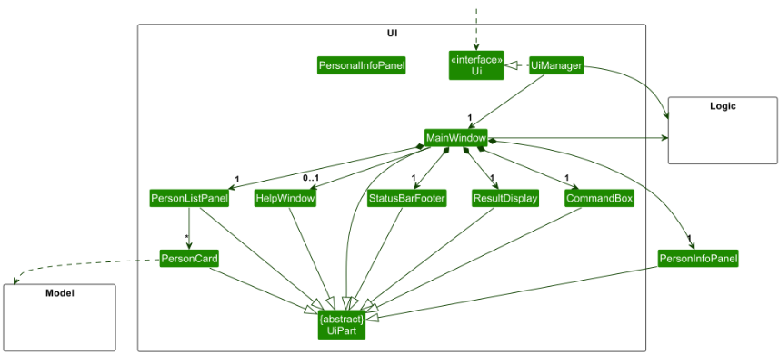

The UI consists of a `MainWindow` that is made up of parts e.g.`CommandBox`, `ResultDisplay`, `PersonListPanel`, `StatusBarFooter` etc. All these, including the `MainWindow`, inherit from the abstract `UiPart` class which captures the commonalities between classes that represent parts of the visible GUI.

The `UI` component uses the JavaFx UI framework. The layout of these UI parts are defined in matching `.fxml` files that are in the `src/main/resources/view` folder. For example, the layout of the [`MainWindow`](https://github.com/AY2526S1-CS2103T-W09-1/tp/blob/master/src/main/java/seedu/address/ui/MainWindow.java) is specified in [`MainWindow.fxml`](https://github.com/AY2526S1-CS2103T-W09-1/tp/blob/master/src/main/resources/view/MainWindow.fxml)

The `UI` component,

* executes user commands using the `Logic` component.
* listens for changes to `Model` data so that the UI can be updated with the modified data.
* keeps a reference to the `Logic` component, because the `UI` relies on the `Logic` to execute commands.
* depends on some classes in the `Model` component, as it displays `Person` object residing in the `Model`.

### Logic component

**API** : [`Logic.java`](https://github.com/AY2526S1-CS2103T-W09-1/tp/blob/master/src/main/java/seedu/address/logic/Logic.java)

Here's a (partial) class diagram of the `Logic` component:

The sequence diagram below illustrates the interactions within the `Logic` component, taking `execute("delete 1")` API call as an example.

:information_source: **Note:** The lifeline for `DeleteCommandParser` should end at the destroy marker (X) but due to a limitation of PlantUML, the lifeline continues till the end of diagram.

How the `Logic` component works:

1. When `Logic` is called upon to execute a command, it is passed to an `AddressBookParser` object which in turn creates a parser that matches the command (e.g., `DeleteCommandParser`) and uses it to parse the command.
1. This results in a `Command` object (more precisely, an object of one of its subclasses e.g., `DeleteCommand`) which is executed by the `LogicManager`.
1. The command can communicate with the `Model` when it is executed (e.g. to delete a person). 
   Note that although this is shown as a single step in the diagram above (for simplicity), in the code it can take several interactions (between the command object and the `Model`) to achieve.
1. The result of the command execution is encapsulated as a `CommandResult` object which is returned back from `Logic`.

Here are the other classes in `Logic` (omitted from the class diagram above) that are used for parsing a user command:

How the parsing works:
* When called upon to parse a user command, the `AddressBookParser` class creates an `XYZCommandParser` (`XYZ` is a placeholder for the specific command name e.g., `AddCommandParser`) which uses the other classes shown above to parse the user command and create a `XYZCommand` object (e.g., `AddCommand`) which the `AddressBookParser` returns back as a `Command` object.
* All `XYZCommandParser` classes (e.g., `AddCommandParser`, `DeleteCommandParser`, ...) inherit from the `Parser` interface so that they can be treated similarly where possible e.g, during testing.

### Model component
**API** : [`Model.java`](https://github.com/AY2526S1-CS2103T-W09-1/tp/blob/master/src/main/java/seedu/address/model/Model.java)

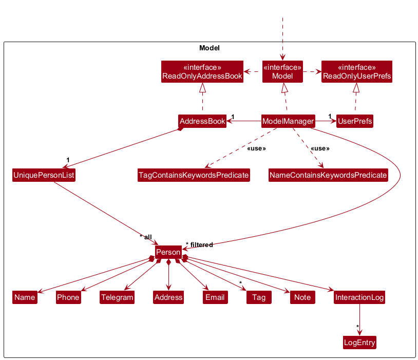

The `Model` component,

* stores the address book data i.e., all `Person` objects (which are contained in a `UniquePersonList` object).
* stores the currently 'selected' `Person` objects (e.g., results of a search query) as a separate _filtered_ list which is exposed to outsiders as an unmodifiable `ObservableList<Person>` that can be 'observed' e.g. the UI can be bound to this list so that the UI automatically updates when the data in the list change.
* stores a `UserPref` object that represents the user’s preferences. This is exposed to the outside as a `ReadOnlyUserPref` objects.
* does not depend on any of the other three components (as the `Model` represents data entities of the domain, they should make sense on their own without depending on other components)

### Storage component

**API** : [`Storage.java`](https://github.com/AY2526S1-CS2103T-W09-1/tp/blob/master/src/main/java/seedu/address/storage/Storage.java)

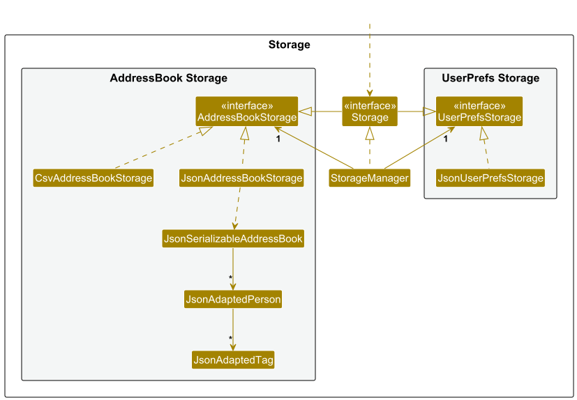

The `Storage` component,
* can save both address book data and user preference data in JSON format, and read them back into corresponding objects.
* inherits from both `AddressBookStorage` and `UserPrefStorage`, which means it can be treated as either one (if only the functionality of only one is needed).
* depends on some classes in the `Model` component (because the `Storage` component's job is to save/retrieve objects that belong to the `Model`)

### Common classes

Classes used by multiple components are in the `seedu.address.commons` package.

--------------------------------------------------------------------------------------------------------------------

## **Version component**

This section describes some noteworthy details on how certain features are implemented.

### Undo/redo feature

The mechanism is facilitated by `AddressBookVersionHistory`. It manages the undo/redo history using two stacks: `undoStack` for past states and `redoStack` for future states. Additionally, it implements the following operations:

* `AddressBookVersionHistory#saveState(ReadOnlyAddressBook)` — Saves the current address book state before making changes.
* `AddressBookVersionHistory#undo(ReadOnlyAddressBook)` — Restores the previous address book state from the undo stack.
* `AddressBookVersionHistory#redo(ReadOnlyAddressBook)` — Restores a previously undone address book state from the redo stack.
* `AddressBookVersionHistory#canUndo()` — Checks if there are states available to undo.
* `AddressBookVersionHistory#canRedo()` — Checks if there are states available to redo.

These operations are exposed in the `Model` interface as `Model#saveAddressBookState()`, `Model#undoAddressBook()`, `Model#redoAddressBook()`, `Model#canUndoAddressBook()`, and `Model#canRedoAddressBook()` respectively.

Given below is an example usage scenario and how the undo/redo mechanism behaves at each step.

Step 1. The `AddressBookVersionHistory` is initialized with the current address book state pushed onto the `undoStack`, while the `redoStack` is empty.

Step 2. The delete command calls `Model#saveAddressBookState()`, which pushes the modified address book state onto the `undoStack` and clears the `redoStack`.

Step 3. The user executes `add n/David …​` to add a new person. The `add` command also calls `Model#commitAddressBook()`, causing another modified address book state to be saved into the `AddressBookVersionHistory`.

:information_source: **Note:** If a command fails its execution, it will not call `Model#commitAddressBook()`, so the address book state will not be saved into the `AddressBookVersionHistory`.

Step 4. The undo command pops the latest state from the `undoStack` and pushes it onto the `redoStack`, restoring the previous address book state from the new top of the `undoStack`.

:information_source: **Note:** If the `undoStack` is empty then there are no previous AddressBook states to restore. The `undo` command uses `Model#canUndoAddressBook()` to check if this is the case. If so, it will return an error to the user rather
than attempting to perform the undo.

The following sequence diagram shows how an undo operation goes through the `Logic` component:

:information_source: **Note:** The lifeline for `UndoCommand` should end at the destroy marker (X) but due to a limitation of PlantUML, the lifeline reaches the end of diagram.

Similarly, how an undo operation goes through the `Model` component is shown below:

The `redo` command does the opposite — it calls `Model#redoAddressBook()`, which pops the latest state from the `redoStack` and pushes it back onto the `undoStack`, restoring that state as the current address book.

:information_source: **Note:** If the `redoStack` is empty then there are no undone AddressBook states to restore. The `redo` command uses `Model#canRedoAddressBook()` to check if this is the case. If so, it will return an error to the user rather than attempting to perform the redo.

Step 5. The user then decides to execute the command `list`. Commands that do not modify the address book, such as `list`, will usually not call `Model#commitAddressBook()`, `Model#undoAddressBook()` or `Model#redoAddressBook()`. Thus, the `AddressBookVersionHistory` remains unchanged.

Step 6. The user executes `clear`, which calls `Model#commitAddressBook()`. Since there are states stored in the `redoStack` (representing redo history), executing a new command clears the `redoStack` — consistent with standard undo/redo behavior.

The following activity diagram summarizes what happens when a user executes a new command:

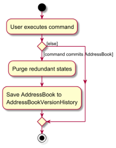

#### Design considerations:

**Aspect: How undo & redo executes:**

* **Alternative 1 (current choice):** Saves the entire address book.
  * Pros: Easy to implement.
  * Cons: May have performance issues in terms of memory usage.

* **Alternative 2:** Individual command knows how to undo/redo by
  itself.
  * Pros: Will use less memory (e.g. for `delete`, just save the person being deleted).
  * Cons: We must ensure that the implementation of each individual command are correct.
_
### Find Command with Fuzzy Matching

The `find` command uses three matching strategies to locate contacts:

1. **Full-word match** (case-insensitive): Exact match of keyword to any word in the name
2. **Fuzzy match**: Uses Levenshtein distance algorithm with threshold of 2 character differences
3. **Substring match**: Only applied for keywords equal to or longer than 4 characters

#### Implementation:
- `NameContainsKeywordsPredicate#matchesKeyword()` implements the matching logic
- Keywords < 4 characters: Only full-word and fuzzy matching applied (prevents noisy results from short queries like "an")
- Keywords >= 4 characters: All three strategies applied
- Each word in a person's name is tested independently

#### Design considerations:
* **Alternative 1 (current)**: Fixed thresholds (4-char cutoff, distance 2)
    * Pros: Predictable behavior, good balance of precision/recall
    * Cons: May not suit all use cases (e.g., names in different languages)
* **Alternative 2**: Configurable thresholds
    * Pros: Users can tune behavior for their needs
    * Cons: Adds complexity to UI/config management

#### Sequence Diagrams
**Find Command Execution Flow:**
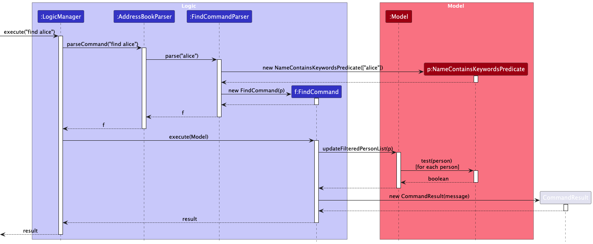

The sequence diagram above shows how a `find` command is parsed and executed through the Logic and Model components.

**Predicate Matching Logic:**
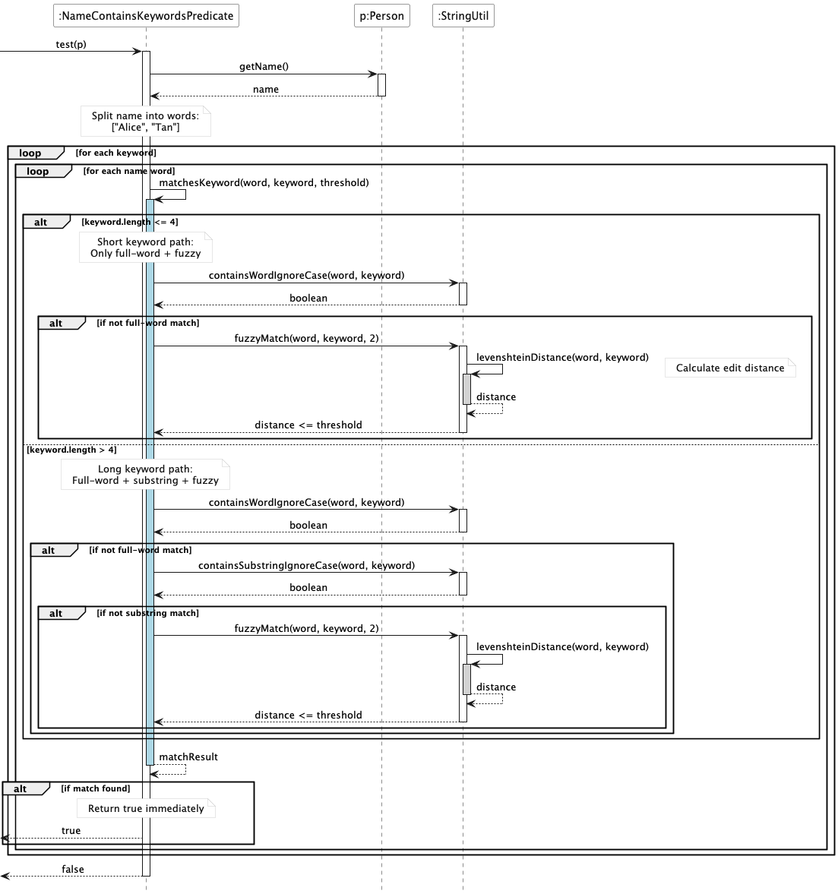

The sequence diagram above details how `NameContainsKeywordsPredicate` tests each person against the search keywords, showing the different matching paths for short (≤4 characters) and long (>4 characters) keywords.

#### Class Diagram
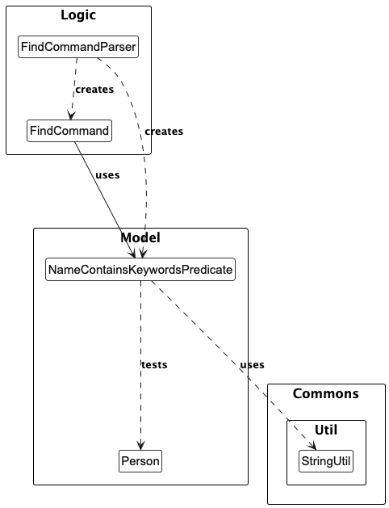

The class diagram shows the relationships between the `FindCommand`, `FindCommandParser`, `NameContainsKeywordsPredicate`, and utility classes.

#### Activity Diagram
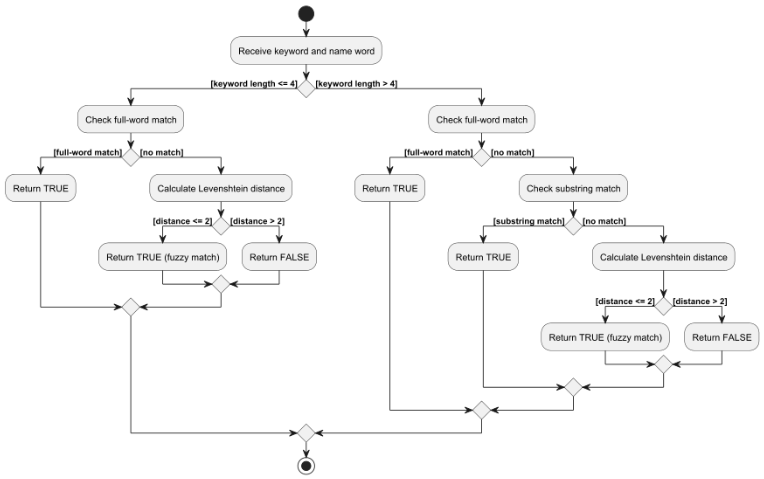

The activity diagram illustrates the decision flow for matching a single keyword against a name word, showing how the keyword length determines which matching strategies are applied.

### Interaction Log feature

The interaction log feature allows users to record interactions with contacts. Each log entry contains a message, an optional type, and a timestamp. The `log` command is used to add new log entries.

The following sequence diagram illustrates the execution of the `log` command:

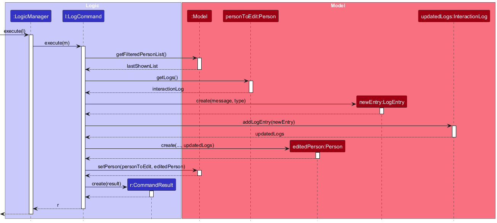

The implementation of this feature is divided into three main classes: `LogCommand`, `InteractionLog`, and `LogEntry`.

*   **`LogEntry`**: This is an immutable class that represents a single log entry. It contains the message, type, and timestamp of the interaction.
*   **`InteractionLog`**: This is also an immutable class that holds a list of `LogEntry` objects. It provides a method `addLogEntry` which returns a new `InteractionLog` instance with the new log entry added. This immutability ensures that the log history of a person cannot be changed accidentally.
*   **`LogCommand`**: This class is responsible for executing the `log` command. When executed, it performs the following steps:
    1.  It parses the user input to get the index of the person, the log message, and the interaction type.
    2.  It retrieves the `Person` object from the model using the provided index.
    3.  It creates a new `LogEntry` object with the provided message and type.
    4.  It calls the `addLogEntry` method on the person's `InteractionLog` to get a new `InteractionLog` with the new entry.
    5.  It creates a new `Person` object with the updated `InteractionLog`.
    6.  Finally, it replaces the old `Person` object in the model with the new one.

This entire process ensures that the data remains consistent and that the application state is managed in a predictable way. The use of immutable objects for `LogEntry` and `InteractionLog` makes the code more robust and easier to reason about.

### Data importing and exporting

The address book is stored in a `.json` file. To facilitate usage across different platforms, import and export features have been incorporated.

The following features have been implemented:
* `Import`ing address books
* `Export`ing address books with tag filters
* Compatibility with `.csv` files

#### Importing address books

The save data is stored by `JsonAddressBookStorage` in a `.json` file. Thus, it would be simple for the user to be able to access a different set of addresses by `import`ing a different `.json` file, which stores a different set of addresses.

An overview of the `import` process is shown as per the activity diagram below:

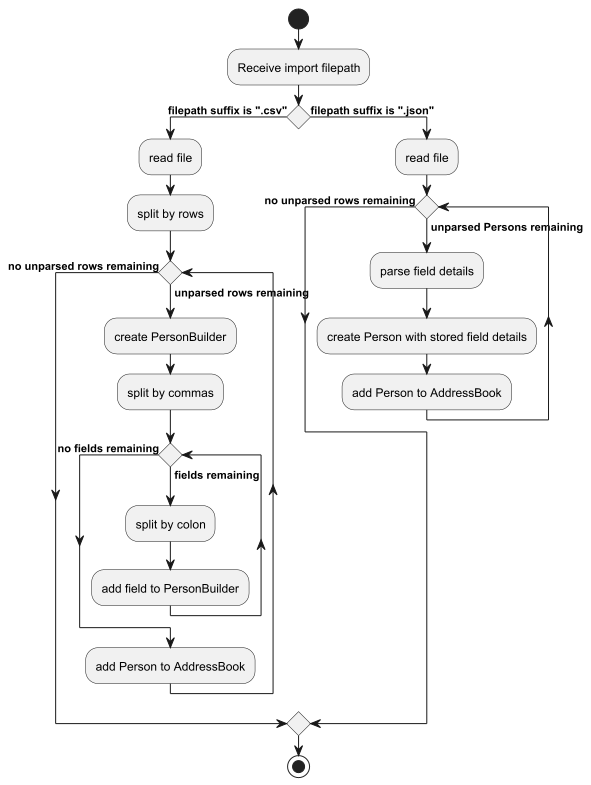

How the `import` function is coordinated across the various components is shown in the sequence diagram below:

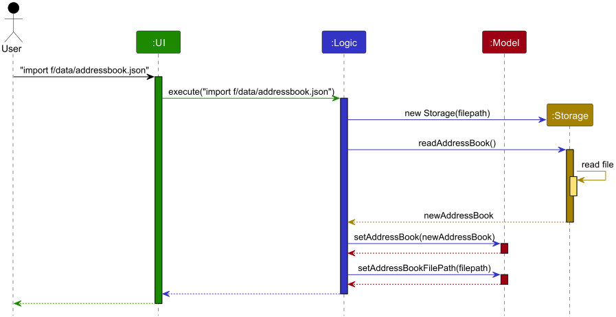

1. The command for `import` is given, along with the target file to be imported.
2. The `UI` calls the `logic` manager to execute the command.
3. The `logic` manager parses the filepath.
4. The `logic` manager creates a new `Storage` for that filepath.
5. The `logic` manager requests the stored data from `Storage` via `readAddressBook`.
6. The `storage` returns the read `AddressBook`.
7. The `logic` manager sets the `model`'s `AddressBook` as the read `AddressBook`.
8. The `logic` manager sets the `model`'s `AddressBook` filepath to the input filepath.

##### Design considerations

* The model is adjusted only after `Storage` has processed the file, confirming that it is a valid storage file.

#### Exporting address books with filters

To `import` files, the user needs to be able to create files that are compatible with the `import` process. The `export` feature serves to facilitate that conversion process, converting the user's cached AddressBook into a compatible file.

An overview of the `export` process is shown as per the activity diagram below:

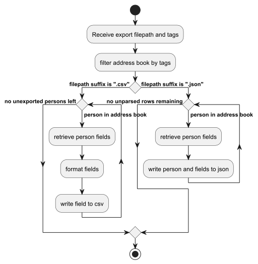

How the `export` function is coordinated across the various components is shown in the sequence diagram below:

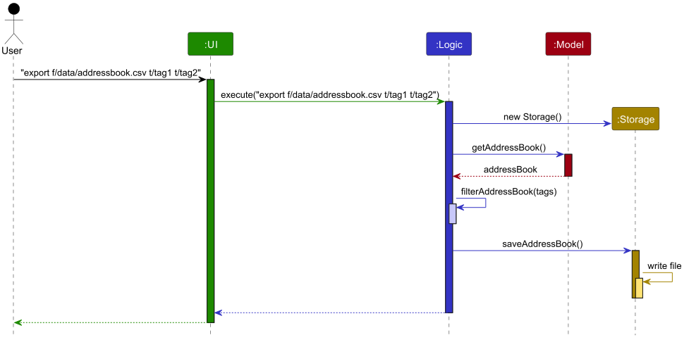

1. The command for `export` is given, along with output destination and any tags.
2. The `UI` calls the `Logic` manager to execute the command.
3. The `Logic` manager parses the filepath.
4. The `Logic` manager creates a new `Storage` for that filepath.
5. The `Logic` manager requests the stored `AddressBook` from the `Model`.
6. The `Model` returns the `AddressBook`.
7. The `Logic` manager retrieves a list of `People` from the `AddressBook`.
8. The `Logic` manager filters the list of `People` with the `Tag`s
9. The `Logic` manager sends the filtered list to the `Storage` object.
10. The `Storage` object writes the filtered list to the destination file.

##### Design considerations

* `Storage` is initialized before the retrieval of the `AddressBook` to ensure file retrieval `exceptions` are thrown before operations are performed.

#### Compatibility with .csv files

Compatibility with `.csv` files has been added, providing users with an alternative file format for `import`ing and `export`ing data. 

`.csv` files can be both exported and imported. 

### Sort Command and Comparators

- The `sort` command allows users to reorder their contact list by a specified field and order.
- Possible fields include `name`, `email`, `phone`, `telegram`, or `address`.
- Possible orders include `asc` or `desc`.
- Note that contacts are sorted by pinned status before the second comparator is applied.

When executed, the `SortCommand` constructs a `Comparator<Person>` based on the selected field and order to be composed on the pinned status comparator by the `Model`.

The default sorting comparator applied on program startup sorts by pinned status first before name in ascending order.

--------------------------------------------------------------------------------------------------------------------

## **Documentation, logging, testing, configuration, dev-ops**

* [Documentation guide](Documentation.md)
* [Testing guide](Testing.md)
* [Logging guide](Logging.md)
* [Configuration guide](Configuration.md)
* [DevOps guide](DevOps.md)

--------------------------------------------------------------------------------------------------------------------

## **Appendix: Requirements**

### Product scope

**Target user profile**:

* Student leaders planning events
* Has a need to manage a significant number of vendor and stakeholder contacts
* Prefer desktop apps over other types
* Can type fast
* Prefers typing to mouse interactions
* Is reasonably comfortable using CLI apps
* Spends significant time sourcing or recalling important contacts for space vendors and NUS staff

**Value proposition**: LinkedUp contact tracking application helps student leaders build and maintain professional networks while keeping vendor and stakeholder contacts organized. Manage contacts faster than a typical mouse/GUI driven app, with features designed specifically for event planning needs.

### User stories

Priorities: High (must have) - `* * *`, Medium (nice to have) - `* *`, Low (unlikely to have) - `*`

| Priority | As a …​ | I want to …​                                                                    | So that I can…​                                                                      |
|----------|---------|---------------------------------------------------------------------------------|--------------------------------------------------------------------------------------|
| `* * *`  | user    | add a new contact                                                               | use it for future reference                                                          |
| `* * *`  | user    | delete a contact                                                                | remove unneeded contacts or contacts with wrong details                              |
| `* * *`  | user    | view all my saved contacts                                                      | refer to my saved contact details in a convenient manner                             |
| `* * *`  | user    | find contacts by keyword                                                        | locate contacts without going through the entire list                                |
| `* * *`  | user    | tag contacts                                                                    | spend less time and effort looking for contact details                               |
| `* *`    | user    | update phone numbers in my contacts                                             | stay in touch even when they change their number                                     |
| `* *`    | user    | update emails in my contacts                                                    | stay in touch even when they change their email                                      |
| `* *`    | user    | sort contacts by fields                                                         | make easy comparisons and faster decisions                                           |
| `* *`    | user    | filter contacts tagged with a specific keyword                                  | quickly find relevant suppliers for specific needs                                   |
| `* *`    | user    | search contacts dynamically                                                     | find them even if I do not remember their full details                               |
| `* *`    | user    | view the app preloaded with sample contacts                                     | understand how the system works                                                      |
| `* *`    | user    | export my contacts in a viewable format                                         | share vendor information with other organizers                                       |
| `* *`    | user    | import my contacts from a common format such as JSON                            | focus on organizing events rather than spend time collating contacts                 |
| `* *`    | user    | share my database file with other organizers                                    | they can use the same vendor information                                             |
| `*`      | user    | update telegram handles in my contacts                                          | stay in touch even when they change their handle                                     |
| `*`      | user    | record notes for each contact                                                   | refer to details about past experiences with them                                    |
| `*`      | user    | view an intuitive visualization of vendors with key information                 | get information at a glance                                                          |
| `*`      | user    | group multiple vendors under a specific event                                   | review which vendors were used for the event                                         |
| `*`      | user    | store my contacts in organized software                                         | easily find the same required contacts used by seniors                               |
| `*`      | user    | undo and redo commands                                                          | recover from mistakes                                                                |
| `*`      | user    | pin the contacts of vendors I need                                              | have these contacts always available at the top                                      |

### Use cases

(For all use cases below, the **System** is `LinkedUp` and the **Actor** is the `user`, unless specified otherwise)

**Use case: U1 - Starting the app**

**Preconditions:** User has downloaded the jar file and has Java 17 configured.

**MSS**

1. User runs the jar file.
2. System converts storage json file into contacts.
3. System displays all stored contacts.

   Use case ends.

**Extensions**

* 2a. No stored contacts list found.
    * 2a1. System creates new save file.
    * Use case resumes from step 3.

**Use case: U2 - Adding a contact**

**Preconditions:** User has started the app.

**MSS**

1. User provides details in the command line for new contact.
2. System internalizes details to create a new contact object.
3. System adds the contact and displays the updated list of contacts.
4. System scrolls to the newly added contact.

   Use case ends.

**Extensions**

* 1a. System detects an invalid input.
    * 1a1. System informs the user of the error.
    * 1a2. User fixes and resubmits their request.
    * Steps 1a1-1a2 are repeated until the data entered is correct.
    * Use case resumes from step 2.

**Use case: U3 - Listing contacts**

**Preconditions:** User has started the app.

**MSS**

1. User requests a list of contacts.
2. System displays all contacts.

   Use case ends.

**Extensions**

* 2a. System does not find any contacts available.
    * 2a1. System displays a message communicating the empty contact list.
    * Use case ends.

**Use case: U4 - Deleting a contact**

**Preconditions:** The contact to be deleted is already in the contact list.

**MSS**

1. User lists contacts (U3).
2. User requests to delete a contact specified by index.
3. System deletes the contact from its storage.
4. System displays the new contact list.

   Use case ends.

**Extensions**

* 2a. System detects an invalid input.
    * 2a1. System informs the user of the error.
    * 2a2. User fixes and resubmits their request.
    * Steps 2a1-2a2 are repeated until the data entered is correct.
    * Use case resumes from step 3.

**Use case: U5 - Tagging a contact**

**Preconditions:** User has started the app and the contact to be tagged is already in the contact list.

**MSS**

1. User lists contacts (U3).
2. User requests to tag a specific contact from the list by index.
3. System adds tag to the list of tags in the chosen contact.
4. System displays message conveying the successful addition of tag.

   Use case ends.

**Extensions**

* 2a. System detects an invalid input.
    * 2a1. System informs the user of the error.
    * 2a2. User fixes and resubmits their request.
    * Steps 2a1-2a2 are repeated until the data entered is correct.
    * Use case resumes from step 3.
* 3a. Tag already exists on the contact (case-insensitive).
    * 3a1. System ignores the duplicate tag and informs user.
    * Use case ends.
* 3b. Contact has reached maximum number of tags (20).
    * 3b1. System rejects the tag and informs user.
    * Use case ends.

**Use case: U6 - Deleting a tag**

**Preconditions:** The tag exists on the target contact.

**MSS**

1. User lists contacts (U3).
2. User requests to delete a tag from a contact by index.
3. System deletes the tag and displays the new list of contacts.

   Use case ends.

**Extensions**

* 2a. System detects an invalid input.
    * 2a1. System informs the user of the error.
    * 2a2. User fixes and resubmits their request.
    * Steps 2a1-2a2 are repeated until the data entered is correct.
    * Use case resumes from step 3.
* 2b. Specified tag does not exist on the contact.
    * 2b1. System informs user that tag is not found.
    * Use case ends.

**Use case: U7 - Finding contacts**

**Preconditions:** User has started the app.

**MSS**

1. User searches for a contact based on a keyword.
2. System displays the list of contacts filtered by keywords.

   Use case ends.

**Extensions**

* 1a. User specifies invalid search parameters.
    * 1a1. System informs user of the error.
    * Use case ends.
* 2a. No contacts match the search criteria.
    * 2a1. System displays empty result set.
    * Use case ends.

**Use case: U8 - Sorting contacts**

**Preconditions:** User has a list of contacts.

**MSS**

1. User requests to sort the contact based on a parameter (name, email, phone number or address).
2. System displays the sorted contact list.

   Use case ends.

**Extensions**

* 1a. User specifies invalid field.
    * 1a1. System informs user of valid field options.
    * Use case ends.
* 1b. User specifies invalid sort order.
    * 1b1. System informs user of valid sort order options.
    * Use case ends.

**Use case: U9 - Exiting the app**

**Preconditions:** User has started the app.

**MSS**

1. User requests to exit the application.
2. System saves updated contact data.
3. System exits the app.

   Use case ends.

**Extensions**

* 2a. System cannot save data to storage.
    * 2a1. System informs user of save failure.
    * 2a2. User chooses to exit anyway or cancel.
    * Use case ends or resumes from step 2.

**Use case: U10 - Exporting contacts**

**Preconditions:** User has started the app.

**MSS**

1. User requests to export contacts.
2. System converts contacts to JSON format.
3. System saves JSON file to designated location.
4. System informs user of successful export.

   Use case ends.

**Extensions**

* 3a. System cannot write to storage location.
    * 3a1. System informs user of the error.
    * Use case ends.

**Use case: U11 - Importing contacts**

**Preconditions:** User has started the app and has a valid JSON contacts file.

**MSS**

1. User provides path to JSON file containing contacts.
2. System validates and parses the JSON file.
3. System adds valid, non-duplicate contacts to storage.
4. System displays updated contact list.

   Use case ends.

**Extensions**

* 2a. File format is invalid or file cannot be read.
    * 2a1. System informs user of the error.
    * Use case ends.
* 3a. Some contacts have invalid data.
    * 3a1. System skips invalid contacts.
    * 3a2. System continues with valid contacts.
    * Use case resumes from step 4.
* 3b. All contacts are duplicates.
    * 3b1. System informs user no new contacts were imported.
    * Use case ends.

**Use case: U12 - Adding notes to a contact**

**Preconditions:** The contact exists in the contact list.

**MSS**

1. User lists contacts (U3).
2. User requests to add notes to a specific contact by index.
3. System adds the notes to the contact.
4. System displays confirmation message.

   Use case ends.

**Extensions**

* 2a. System detects an invalid index.
    * 2a1. System informs the user of the error.
    * 2a2. User fixes and resubmits their request.
    * Steps 2a1-2a2 are repeated until valid index is entered.
    * Use case resumes from step 3.

**Use case: U13 - Pinning a contact**

**Preconditions:** The contact to be pinned exists in the contact list.

**MSS**

1. User lists contacts (U3).
2. User requests to pin a specific contact by index.
3. System marks the contact as pinned.
4. System displays the contact at the top of the list.

   Use case ends.

**Extensions**

* 2a. System detects an invalid index.
    * 2a1. System informs the user of the error.
    * Use case ends.

**Use case: U14 - Unpinning a contact**

**Preconditions:** The contact is currently pinned.

**MSS**

1. User lists contacts (U3).
2. User requests to unpin a specific contact by index.
3. System removes the pinned status from the contact.
4. System displays the contact in its normal sorted position.

   Use case ends.

**Extensions**

* 2a. System detects an invalid index.
    * 2a1. System informs the user of the error.
    * Use case ends.

**Use case: U15 - Updating contact information**

**Preconditions:** The contact to be updated exists in the contact list.

**MSS**

1. User lists contacts (U3).
2. User requests to update specific fields (phone, email, or telegram handle) of a contact by index.
3. System validates the new information.
4. System updates the contact with new information.
5. System displays the updated contact list.
6. System scrolls to the newly updated contact.

   Use case ends.

**Extensions**

* 2a. System detects an invalid index.
    * 2a1. System informs the user of the error.
    * 2a2. User fixes and resubmits their request.
    * Steps 2a1-2a2 are repeated until valid index is entered.
    * Use case resumes from step 3.
* 3a. New information format is invalid.
    * 3a1. System informs user of the error.
    * 3a2. User fixes and resubmits their request.
    * Steps 3a1-3a2 are repeated until valid information is entered.
    * Use case resumes from step 4.
* 3b. New phone number or email already exists in another contact.
    * 3b1. System rejects the update.
    * Use case ends.

**Use case: U16 - Filtering contacts by tag**

**Preconditions:** User has started the app and contacts with tags exist.

**MSS**

1. User requests to filter contacts by a specific tag keyword.
2. System displays all contacts that have the matching tag.

   Use case ends.

**Extensions**

* 2a. No contacts have the specified tag.
    * 2a1. System displays empty result set.
    * Use case ends.

**Use case: U17 - Grouping contacts by event**

**Preconditions:** User has started the app and contacts exist.

**MSS**

1. User tags multiple contacts (U5) with the same tag meant to represent an event.
2. User filters contacts by the event's tag (U16).

   Use case ends.

### Non-Functional Requirements

1. Should work on any _mainstream OS_ (Windows, Linux, MacOS) as long as it has Java `17` or above installed.
2. Should be able to hold up to 1000 contacts without a noticeable sluggishness in performance for typical usage.
3. A user with above average typing speed for regular English text (i.e. not code, not system admin commands) should be able to accomplish most of the tasks faster using commands than using the mouse.
4. Should display all contacts within 2 seconds after initial load.
5. Commands should execute within 2 seconds under normal load.
6. Import/export operations should process files up to 5MB within 5 seconds.
7. Should be able to retrieve 100 contacts without noticeable sluggishness.
8. Should be able to store at least 100 contacts for every user.

### Glossary

* **Mainstream OS**: Windows, Linux, Unix, MacOS
* **Student Leader**: A student in NUS directly involved in supporting or organizing an event
* **Contact**: A data structure representing a person's contact information. It consists of a name, email address, phone number, address, and any tags associated with that contact.
* **Tag**: A string input by the user to characterize contacts for organizational and filtering purposes
* **Vendor**: An external supplier or service provider that student leaders work with for events (e.g., caterers, merchandise suppliers, venue staff)
* **Index**: The numerical position of a contact in the displayed contact list, used to reference specific contacts in commands
* **JSON (JavaScript Object Notation)**: A lightweight data format used for storing and exchanging contact information
* **Duplicate Contact**: A contact with the same phone number or email address as an existing contact in the system
* **Pinned Contact**: A contact marked for priority display, appearing at the top of the contact list regardless of sort order
* **NUS**: National University of Singapore
* **IG Head**: Interest Group Head, a leadership position in student organizations

--------------------------------------------------------------------------------------------------------------------

## **Appendix: Instructions for manual testing**

Given below are instructions to test the app manually.

:information_source: **Note:** These instructions only provide a starting point for testers to work on;
testers are expected to do more *exploratory* testing.

### Launch and shutdown

1. Initial launch

   1. Download the jar file and copy into an empty folder

   1. Double-click the jar file Expected: Shows the GUI with a set of sample contacts. The window size may not be optimum.

1. Saving window preferences

   1. Resize the window to an optimum size. Move the window to a different location. Close the window.

   1. Re-launch the app by double-clicking the jar file. 
       Expected: The most recent window size and location is retained.

### Deleting a person

1. Deleting a person while all persons are being shown

   1. Prerequisites: List all persons using the `list` command. Multiple persons in the list.

   1. Test case: `delete 1` 
      Expected: First contact is deleted from the list. Details of the deleted contact shown in the status message. Timestamp in the status bar is updated.

   1. Test case: `delete 0` 
      Expected: No person is deleted. Error details shown in the status message. Status bar remains the same.

   1. Test case: `delete -5` 
         Expected: Only positive integer accepted. Error details of index of existing person being needed will show.

      1. Other incorrect delete commands to try: `delete`, `delete x`, `...` (where x is larger than the list size) 
         Expected: Similar to previous.

### Saving data

1. Dealing with missing/corrupted data files

   1. _Our software will still open, but it will refuse to load in the corrupted data. When new valid data is added, it will only save the new data to resume its normal functionality._
