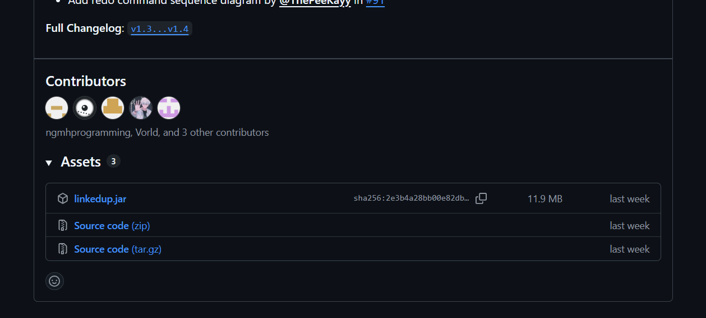
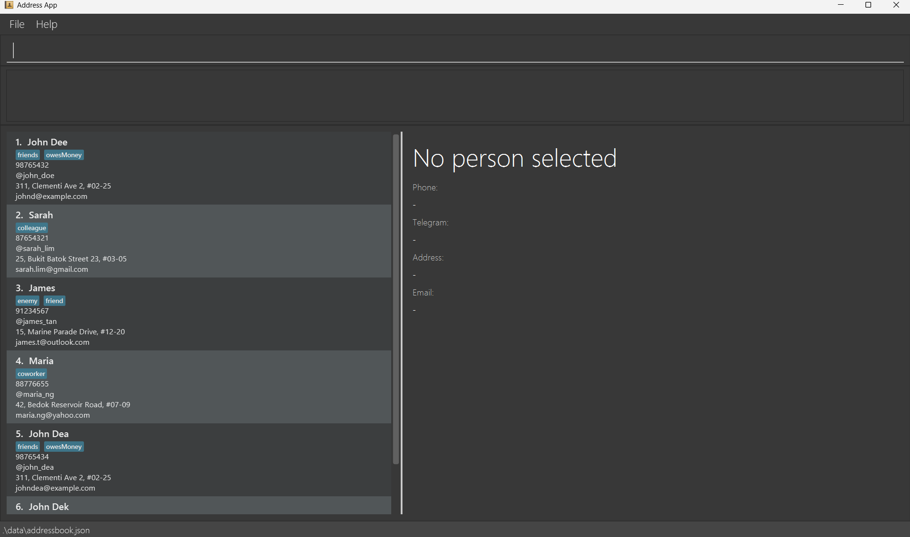
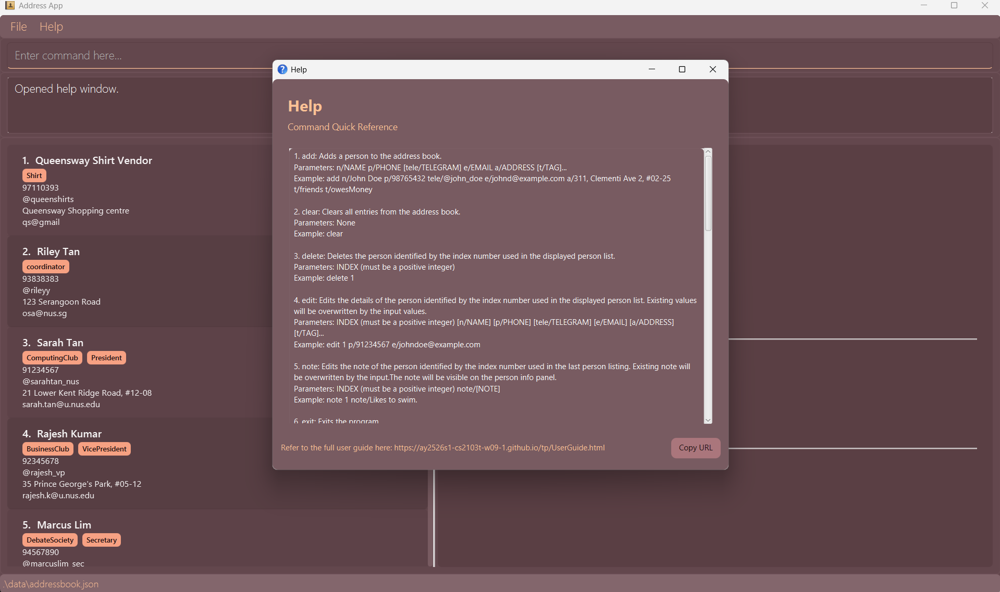
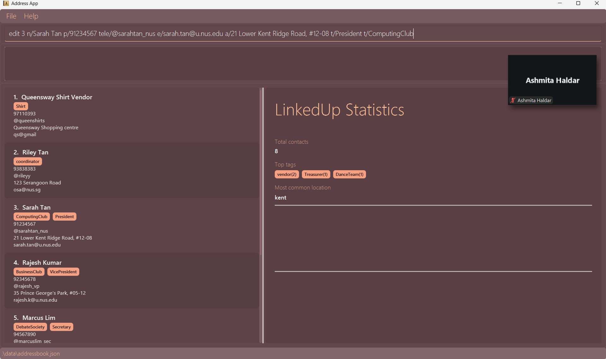
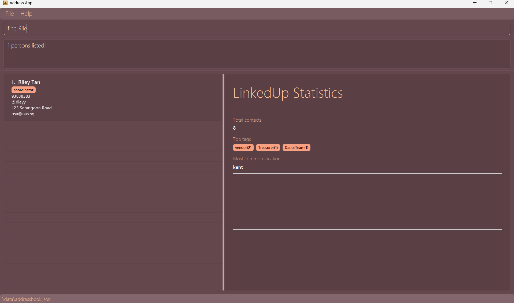

## LinkedUp User Guide

**LinkedUp is designed for university student leaders** including club presidents, society executives, event organizers, student council members, and committee heads who manage extensive networks of contacts across campus and beyond. These users typically manage 50-500+ contacts including fellow students, faculty advisors, alumni mentors, corporate sponsors, venue coordinators, and partner organization representatives. **The application assumes users are comfortable with typing and prefer keyboard-based workflows** over mouse-driven interfaces, valuing speed and efficiency in data entry and retrieval. Users are expected to be familiar with basic command syntax similar to using search bars or messaging apps, and need categorization and tagging capabilities to organize contacts by role, project, or affiliation without complex navigation.

**LinkedUp empowers student leaders to organize their professional networks efficiently through fast, typing-based commands.** Instead of clicking through multiple menus, users simply type short commands to add contacts, search for specific people, categorize relationships, and retrieve information instantly. The application displays all contact information, search results, and organized lists visually while letting users work at typing speed, combining the speed of text-based input with the clarity of visual presentation. Whether you're a club president tracking member information, an event organizer managing vendor contacts, or a society executive coordinating with sponsors, **LinkedUp helps you maintain your network without slowing you down**, making it ideal for users who need quick access to their contacts during busy coordination work.

- [Setup](#setup)
- [QuickStart](#quickstart)
- [Features](#features)
  * [Viewing help](#view)
  * [Adding a contact](#add)
  * [Listing all contacts](#list)
  * [Editing a contact](#edit)
  * [Adding a note to a contact](#note)
  * [Locating contacts by name](#find)
  * [Filtering contacts by tags](#filter)
  * [Deleting a contact](#delete)
  * [Pinning a contact](#pin)
  * [Unpinning a contact](#unpin)
  * [Undoing a command](#undo)
  * [Redoing a command](#redo)
  * [Importing a save file](#import)
  * [Exporting your save file to .json or .csv](#export)
  * [Sorting contacts](#sort)
  * [Clear contacts](#clear)
  * [Exiting the app](#exit)
- [Saving the data](#savedata)
- [Editing the data file](#editdata)
- [FAQ](#faq)
- [Known Issues](#issues)
- [Command Summary](#summary)
- [Glossary](#glossary)

--------------------------------------------------------------------------------------------------------------------

## [Setup](#toc)

- System requirements:
  - Ensure you have Java `17` or above installed in your Computer by executing `java -version`. 
     **Mac users:** Ensure you have the precise JDK version prescribed [here](https://se-education.org/guides/tutorials/javaInstallationMac.html).

- Downloading LinkedUp:
  - Navigate to the release page on [this Github repository](https://github.com/AY2526S1-CS2103T-W09-1/tp/releases).
  - Download the latest `.jar` file from the latest release by clicking it (it should be the first entry).
    
  - Save the file to the folder you want to use as the _home folder_ for your LinkedUp installation.

- Running LinkedUp
  - Open a command terminal, `cd` into the folder you put the jar file in (e.g `cd linkedupfolder`), and use the `java -jar linkedup.jar` command to run the application. 
     A GUI similar to the below should appear in a few seconds. Note how the app contains some sample data. 
     

## [QuickStart](#toc)

1. Type the command in the command box and press Enter to execute it. e.g. typing **`help`** and pressing Enter will open the help window. 
   Some example commands you can try:

    * `list` : Lists all contacts.

   * `add n/Sarah Tan p/91234567 tele/@sarahtan_nus e/sarah.tan@u.nus.edu a/21 Lower Kent Ridge Road, #12-08 t/President t/ComputingClub
` : Adds a contact named `Sarah Tan` to LinkedUp.

    * `delete 3` : Deletes the 3rd contact shown in the current list.

    * `clear` : Deletes all contacts.

    * `exit` : Exits the app.

1. Refer to the [Features](#features) below for details of each command.

--------------------------------------------------------------------------------------------------------------------

## [Features](#toc)

**:information_source: Notes about the command format:** 

* Words in `UPPER_CASE` are the parameters to be supplied by the user. 
  e.g. in `add n/NAME`, `NAME` is a parameter which can be used as `add n/John Doe`.

* Items in square brackets are optional. 
  e.g `n/NAME [t/TAG]` can be used as `n/John Doe t/friend` or as `n/John Doe`.

* Items with `…`​ after them can be used multiple times including zero times. 
  e.g. `[t/TAG]…​` can be used as ` ` (i.e. 0 times), `t/friend`, `t/friend t/family` etc.

* Parameters can be in any order. 
  e.g. if the command specifies `n/NAME p/PHONE_NUMBER`, `p/PHONE_NUMBER n/NAME` is also acceptable.

* Extraneous parameters for commands that do not take in parameters (such as `help`, `list`, `exit` and `clear`) will be ignored. 
  e.g. if the command specifies `help 123`, it will be interpreted as `help`.

* If you are using a PDF version of this document, be careful when copying and pasting commands that span multiple lines as space characters surrounding line-breaks may be omitted when copied over to the application.

### [Viewing help : `help`](#toc) 

Shows a message explaining how to access the help page.

Format: `help`

:bulb: **Tip:**
The command line will prompt the correct format when syntax is wrong.

### [Adding a contact: `add`](#toc) 

Adds a contact to the address book.

Format: `add n/NAME p/PHONE_NUMBER [tele/TELEGRAM] e/EMAIL a/ADDRESS [t/TAG]…​`

:bulb: **Tip:**
A contact can have any number of tags (including 0)

**WARNING**: Email does not check for domains like .com because of unique organisations

Example:

- `add n/John Doe p/98765432 tele/@john_doe e/johnd@example.com a/311, Clementi Ave 2, #02-25 t/friends t/owesMoney`

### [Listing all contacts : `list`](#toc) 

Shows a list of all contacts in the address book.

Format: `list`

### [Editing a contact : `edit`](#toc) 

Edits an existing contact in the address book.

Format: `edit INDEX​`

* Autofills edit command for contact at index without executing. The index **must be a positive integer** 1, 2, 3, …​
* Make changes and press enter again to confirm edits

Example:
* `edit 3`

The command line will autofill the person in index 3 as shown below without changing actual data

:bulb: **Tip:**
Use this shortcut to save time and ensure correct syntax

Format: `edit INDEX [n/NAME] [p/PHONE] [e/EMAIL] [a/ADDRESS] [t/TAG]…​`

* Edits the contact at the specified `INDEX`. The index refers to the index number shown in the displayed contact list. The index **must be a positive integer** 1, 2, 3, …​
* At least one of the optional fields must be provided.
* Existing values will be updated to the input values.
* When editing tags, the existing tags of the contact will be removed i.e adding of tags is not cumulative.
* You can remove all the contact’s tags by typing `t/` without
  specifying any tags after it.

Examples:
*  `edit 1 p/91234567 e/queenspants@gmail.com` Edits the phone number and email address of the 1st contact to be `91234567` and `queenspants@gmail.com` respectively.
*  `edit 2 n/Betsy Crower t/` Edits the name of the 2nd contact to be `Betsy Crower` and clears all existing tags.

### [Adding a note to a contact : `note`](#toc) 

Adds or edits a freeform note for an existing contact in the address book. The note will be displayed in the contact info panel.

Format: `note INDEX note/[NOTE]`

* Adds or edits the note of the contact at the specified `INDEX`.
* The index refers to the index number shown in the displayed contact list.
* The index **must be a positive integer** 1, 2, 3, …​
* The note can contain any text and will be visible in the contact info panel.
* To remove a note, use `note INDEX note/` without specifying any text after `note/`.
* Existing notes will be overwritten by the new note.

Examples:
* `note 1 note/Likes to swim.` Adds the note "Likes to swim." to the 1st contact.
* `note 2 note/Prefers email communication` Adds a note about communication preference to the 2nd contact.
* `note 1 note/` Removes the note from the 1st contact.

### Logging an interaction with a person : `log`

Adds a log entry to document an interaction with an existing contact in the address book.

Format: `log INDEX m/MESSAGE [t/TYPE]`

* Adds a log entry for the person at the specified `INDEX`.
* The index refers to the index number shown in the displayed person list.
* The index **must be a positive integer** 1, 2, 3, …​
* The `MESSAGE` describes the interaction.
* The optional `TYPE` specifies the type of interaction (e.g., "call", "meeting", "email").

Examples:
* `log 1 m/Called about catering quote, they'll email by Friday t/call`
* `log 2 m/Informed to deliver goods by 29/11/25`

### [Locating contacts by name: `find`](#toc) 

Finds contacts whose names contain any of the given keywords.

Format: `find KEYWORD [MORE_KEYWORDS]`

* The search is case-insensitive. e.g `hans` will match `Hans`
* The order of the keywords does not matter. e.g. `Hans Bo` will match `Bo Hans`
* Only the name is searched.
* Only full words will be matched e.g. `Han` will not match `Hans`
* Fuzzy matching is supported: minor typos are tolerated (e.g. \`find Jhn\` will match \`John\`).
* contacts matching at least one keyword will be returned (i.e. `OR` search).
  e.g. `Hans Bo` will return `Hans Gruber`, `Bo Yang`

Examples:
* `find John` returns `john` and `John Doe`
* `find mario` returns `Mario Wong` and `Maria`
* `find Rile` returns `Riley Tan` 
  

:bulb: **Tip:**
Use five or more characters to utilize fuzzy search effectively

### [Filtering contacts by tags: `filter`](#toc) 

Filters contacts who has any of the given tags.

Format: `filter TAG [MORE_TAG]`

* The search is case-insensitive. e.g `friends` will match `Friends`
* The order of the keywords does not matter. e.g. `friends colleagues` will match contacts with either tag
* Only the tags are searched.
* Only exact tag matches will be matched e.g. `friend` will not match `friends`
* contacts matching at least one keyword will be returned (i.e. `OR` search).
  e.g. `filter friends colleagues` will return contacts tagged with `friends` or `colleagues` or both

Examples:
* `filter friends` returns all contacts tagged with `friends`
* `filter friends colleagues` returns all contacts tagged with either `friends` or `colleagues`

### [Deleting a contact : `delete`](#toc) 

Deletes the specified contact from the address book.

Format: `delete INDEX`

* Deletes the contact at the specified `INDEX`.
* The index refers to the index number shown in the displayed contact list.
* The index **must be a positive integer** 1, 2, 3, …​

Examples:
* `list` followed by `delete 2` deletes the 2nd contact in the address book.
* `find Betsy` followed by `delete 1` deletes the 1st contact in the results of the `find` command.

### [Pinning a contact : `pin`](#toc) 

Pins the specified contact to keep them at the top of the contact list.

Format: `pin INDEX`

* Pins the contact at the specified `INDEX`.
* The index refers to the index number shown in the displayed contact list.
* The index **must be a positive integer** 1, 2, 3, …​
* Pinned contacts will always appear at the top of the list, even when sorting or filtering.

Examples:
* `list` followed by `pin 2` pins the 2nd contact in the address book.
* `find Betsy` followed by `pin 1` pins the 1st contact in the results of the `find` command.

### [Unpinning a contact : `unpin`](#toc) 

Unpins the specified contact, removing it from the pinned position.

Format: `unpin INDEX`

* Unpins the contact at the specified `INDEX`.
* The index refers to the index number shown in the displayed contact list.
* The index **must be a positive integer** 1, 2, 3, …​
* The contact must already be pinned.

Examples:
* `list` followed by `unpin 1` unpins the 1st contact in the address book.

### [Undoing a command : `undo`](#toc) 

* Undo last action
* Reverts the effects of the following commands:
    * Add
    * Delete
    * Edit
    * Clear
    * Pin
    * Unpin

:bulb: **Tip:**
Useful for any unintentional mistakes

### [Redoing a command : `redo`](#toc) 

* Redo last action, reverting state of application to that before previous undo
* Redo history will be cleared when commands that edit the state of the data are made

### [Importing a save file : `import`](#toc) 

Imports the details stored in the specified file

Format: `import f/FILE`

:bulb: **Tip:**
Use relative addresses for easier referencing!

* Either a `.json` or a `.csv` file can be used.

Example:
* Importing a json file: `import f/data/addressbook.json`
* Importing a csv file: `import f/data/addressbook.csv`

### [Exporting your save file to `.json` or `.csv` : `export`](#toc) 

Exports your saved data to a `.json` or `.csv` file.

Format: `export f/FILE [t/TAG]...`

Options:
* `FILE`: Filepath of export file. File must have extension `.json` or `.csv`.
* `[TAG]`: Tags to filter the contact list before exporting. Only contacts with all the provided tags will be exported.

:bulb: **Tip:**
Use relative addresses for easier referencing!

### [Sorting Contacts: `sort`](#toc) 
Sort contacts via a specific field in a specific order

Format: `sort [f/FIELD] [o/ORDER]`

- If `FIELD` is not specified, the default is `name`
- If `ORDER` is not specified, the default is `asc`
- Pinned contacts are sorted separately from unpinned contacts and will remain pinned to the top
- Sorting is not persistent when LinkedUp is relaunched

Options:
* `[FIELD]`: One of:
    * `name`
    * `phone`
    * `email`
    * `telegram`
    * `address`
* `[ORDER]`: One of:
    * `asc`
    * `desc`

Example
* `sort f/name o/asc` sorts all contacts by name in ascending order
* `sort f/address o/desc` sorts all contacts by address in descending order

### [Clearing all entries : `clear`](#toc) 

Format: `clear`

A warning will pop up, where you can type `clear confirm` to confirm the deletion.

**WARNING**: Deletes all contact details. Data cannot be retrieved after you clear and exit the app.

Format: `clear confirm`

Clears all entries from the address book.

### [Exiting the program : `exit`](#toc) 

Exits the program.

Format: `exit`

### [Saving the data](#toc) 

LinkedUp data are saved in the hard disk automatically after any command that changes the data. There is no need to save manually.

### [Editing the data file](#toc) 

LinkedUp data are saved automatically as a JSON file `[JAR file location]/data/addressbook.json`. Advanced users are welcome to update data directly by editing that data file.

:exclamation: **Caution:**
If your changes to the data file makes its format invalid, LinkedUp will discard all data and start with an empty data file at the next run. Hence, it is recommended to take a backup of the file before editing it. 
Furthermore, certain edits can cause LinkedUp to behave in unexpected ways (e.g., if a value entered is outside of the acceptable range). Therefore, edit the data file only if you are confident that you can update it correctly.

--------------------------------------------------------------------------------------------------------------------

## [FAQ](#toc) 

**Q**: How do I transfer my data to another Computer? 
**A**: Follow all instructions below in order  

1. You can use `export f/FILE` to create either a `.csv` file or a `.json` file.
1. Copy your file of choice to your other computer, then use `import f/FILE` to use your data in your other computer.

--------------------------------------------------------------------------------------------------------------------

## [Known issues](#toc) 

1. **When using multiple screens**, if you move the application to a secondary screen, and later switch to using only the primary screen, the GUI will open off-screen. The remedy is to delete the `preferences.json` file created by the application before running the application again.
1. **If you minimize the Help Window** and then run the `help` command (or use the `Help` menu, or the keyboard shortcut `F1`) again, the original Help Window will remain minimized, and no new Help Window will appear. The remedy is to manually restore the minimized Help Window.

--------------------------------------------------------------------------------------------------------------------

## [Command summary](#toc) 

Action | Format, Examples
--------|------------------
**Add** | `add n/NAME p/PHONE_NUMBER e/EMAIL a/ADDRESS [t/TAG]…​`   e.g., `add n/James Ho p/22224444 e/jamesho@example.com a/123, Clementi Rd, 1234665 t/friend t/colleague`
**Clear** | `clear`
**Delete** | `delete INDEX`  e.g., `delete 3`
**Edit autofill** | `edit INDEX ​`  e.g.,`edit 2`
**Edit** | `edit INDEX [n/NAME] [p/PHONE_NUMBER] [e/EMAIL] [a/ADDRESS] [t/TAG]…​`  e.g.,`edit 2 n/James Lee e/jameslee@example.com`
**Log** | `log INDEX m/MESSAGE [t/TYPE]`  e.g., `log 1 m/Called about catering quote t/call` 
**Note** | `note INDEX note/[NOTE]`  e.g., `note 1 note/Likes to swim.`
**Filter** | `filter TAG [MORE_TAGS]`  e.g., `filter friends colleagues`
**Find** | `find KEYWORD [MORE_KEYWORDS]`  e.g., `find James Jake`
**List** | `list`
**Undo** | `undo`
**Redo** | `redo`
**Import** | `import f/FILE`  e.g., `import f/data/linkedup.json`
**Export** | `export f/FILE [t/TAG]...`   e.g., `export f/data/linkedup.json t/colleagues`
**Sort** | `sort [f/FIELD] [o/ORDER]`
**Pin** | `pin INDEX`  e.g., `pin 2`
**Unpin** | `unpin INDEX`  e.g., `unpin 1`
**Help** | `help`

## [Glossary](#toc) 

Term | Meaning
--------|------------------
**Student Leader** | A university student with management responsibilities
**Vendor** | A provider of resource that student leaders interact with to obtain goods and services (e.g shirt, food)
**Contact** | A set of details that represents a person as an entity
**Command** | A specific instruction provided by the user
**Parameter** | Details provided by the user to alter command behaviours
**Log** | Remarks on the modification of information of a specific contact with a time attached
**Note** | Simple comments pertaining to a specific contact

